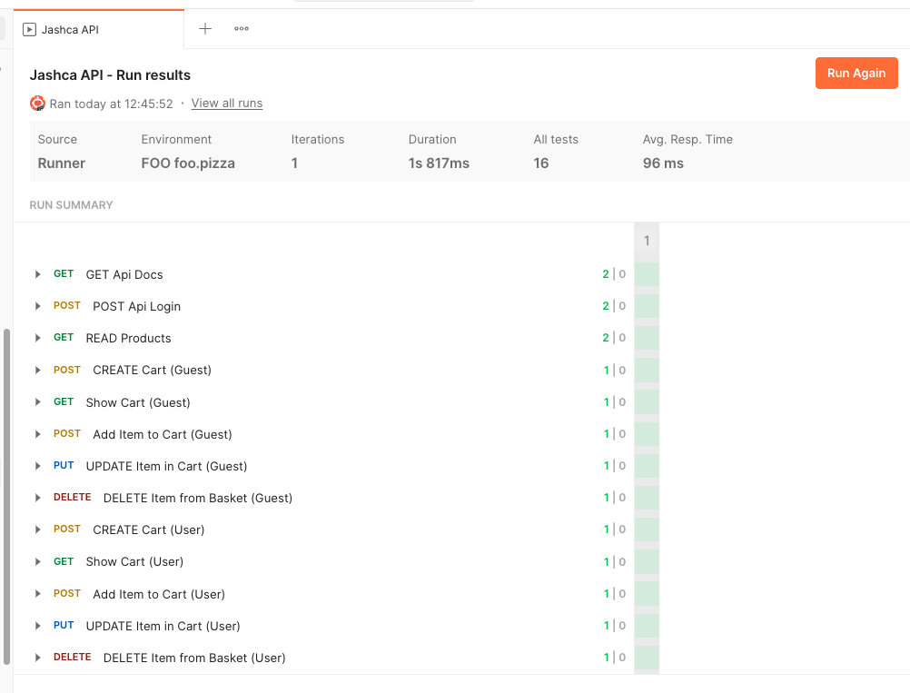

# JaShCa RESTful API

JaShCa (Just another Shopping Cart) is a RESTful API for managing Shopping Carts. 


## TechStack

+ Docker Compose
+ PHP 8.2+
+ Symfony 6.3
+ PostgreSQL
+ Redis

## Development Setup

### Requirements

+ Docker Version ^24.0 (e.g. via Docker Desktop 4.24)
+ Docker Compose Version v2.22.0-desktop.2
+ `make` (installable on macOS via `brew install make`)

Note: tested only on OS/Arch: darwin/arm64)

### Installation

via Makefile:

```shell
make dev-init
```

The application, by default, should be running at: [http://localhost:4444](http://localhost:4444)

### Open Api Docs

Check out the docs:  [http://localhost:4444/api/doc](http://localhost:4444/api/doc)


### Execute Symfony Console Commands

Shell inside PHP-Container

```shell
make shell
bin/console about
```

### Tests

Execute all the tests:


```shell
make docker.up
make test
```

## Authentication

Authentication is provided through the [LexikJWTAuthenticationBundle](https://github.com/lexik/LexikJWTAuthenticationBundle).

A JWT can be obtained via 

```shell
curl -X POST -H "Content-Type: application/json" \
http://localhost:4444/api/login \
-d '{"username":"john.smith@example.org","password":"pwned1234"}'
```

See `./fixtures/users.yaml` for available test Users.


## Test Data

Reset the test data by executing the Alice fixtures:

```shell
make fixtures
```

## Postman Collection

All available endpoints can be tested via Postman.

Import the collection from `./docs/Jashca API.postman_collection.json` and run all tests:




